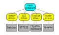

# EE 445L Lab 3 Report

- 'Firstname Lastname (eid123)'
- 'Firstname Lastname (eid123)'

Objectives
----------

-   What did you do to complete this lab?
-   What components were you learning about?
-   Why do you think we made you do this lab?
-   Aim for 5-12 bullet points

Preparation Questions
---------------------

-   *Power budget*

    def

-   *Device driver*

    def

-   *Critical section*

    def

-   *Latency*

    def

-   *Time jitter*

    def

-   *Modular programming*

    def

Hardware Design
---------------

// See the readme for info on exporting schematics.

Software Design
---------------

// If your call graph is identical to the one in the lab document, delete
// this section. Otherwise, edit the included call graph image to
// accurately reflect your code. Make sure to export the .svg as a .pdf, as
// LaTeX doesn't like svgs.

Measurement Data
----------------

// Note: image names and extensions should be changed to match your
files

### Power noise

// O-scope capture of the 5V and 3.3V power coming out of Launchpad

### Speaker output

// O-scope capture of audio signal coming out of speaker pin on
Launchpad

### Current measurements

Without speaker:

With speaker on:

Analysis and Discussion
-----------------------

1.  *Give two ways to remove a critical section.*

    You know the drill

2.  *How long does it take to update the LCD with a new time?*

	

3.  *What would be the disadvantage of updating the LCD in the
    background ISR?*

	

4.  *Did you redraw the entire clock for each output? If so, how could
    you have redesigned the LCD update to run much faster, and create a
    lot less flicker?*

	

5.  *Assuming the system were battery powered, list three ways you could
    have saved power.*

	

